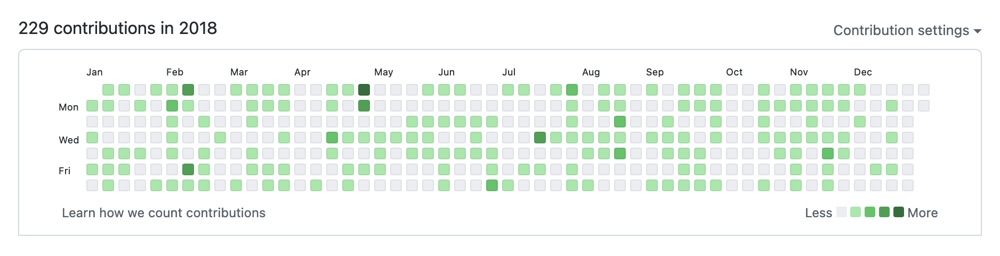

# GitHub Commit Bot

Generate Organic™ GitHub activity
<br>_My most insidious idea yet_

<br>

<p align="center">
  
</p>

<br>

A few commits per day (randomized),
<br>commit-bot adds today's line:

```
Commit: Wed Sep 25 22:00:00 EDT 2019
```

<br><br>

> But [@theshteves](https://github.com/theshteves),
> <br>I want this to commit every day

_Oh hush_

Nobody commits every day
<br>Is that what you want?
<br>🚫 Sorry, not today

We're looking for a more realistic distribution of activity throughout the year

<br><br>

## Getting Started

[Install `git` if `git --version` errors out](https://github.com/git-guides/install-git)

<br>

1. Open your command-line
   <br>& navigate to whatever folder you prefer

2. [Fork this project](https://docs.github.com/en/free-pro-team@latest/github/getting-started-with-github/fork-a-repo) on GitHub

3. Navigate to your new copy of this project on GitHub and setup GitHub Actions to automate commmits

> NOTE:
> <br>Create a **GitHub Personal Access Token (PAT)** with `Contents: Read & Write` and `Workflows: Read & Write` permissions.
> <br>Add it as a GitHub secret named `GH_PAT` under **Settings → Secrets and variables → Actions**

4. Go to the **Actions** tab in your repository and ensure the workflow is running

5. To manually trigger the workflow, select "GitHub Activity Automation" in **Actions** and click **Run workflow**

> To verify your setup:
>
> ```shell
> git log --oneline
> ```
>
> This should show the automated commits appearing over time 🎉
